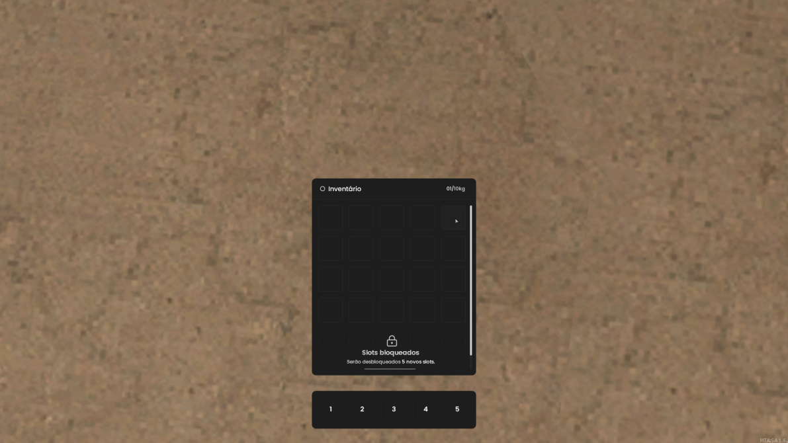

# 🚩 Sistema de inventário.



## Descrição

Inventário simples com sistema de cache para otimização do servidor, utilizando boas práticas de segurança para proteger o seu ambiente.

## Instalação

### Requisitos

-   MTA:SA 1.6.0

### Instruções de Download e Instalação

1. Faça o clone ou download do repositório.
2. Faça o download do MTA:SA em sua maquina: https://multitheftauto.com/
3. Coloque o projeto na pasta: "MTA San Andreas 1.6\server\mods\deathmatch\resources".

## Configuração

1. Abra o arquivo `src/shared/config.lua`.
2. Ajuste as configurações conforme necessário.

## Uso

### Comandos/Atalhos

-   Pressione a tecla B (pode ser alterada nas configurações do projeto) para visualizar o inventário.

### Funções exportáveis

#### Obter dados do inventário pela conta.

```lua
exports["mta-inventory"]:getAccountInventory(account)
```

| Parâmetro | Tipo      | Descrição                |
| :-------- | :-------- | :----------------------- |
| `account` | `account` | Nome da conta do usuário |

#### Obter item do inventário do player.

```lua
exports["mta-inventory"]:getPlayerItem(player, itemID)
```

| Parâmetro | Tipo      | Descrição         |
| :-------- | :-------- | :---------------- |
| `player`  | `element` | Element do player |
| `itemID`  | `number`  | Item do ID        |

#### Dar item para o inventário do player.

```lua
exports["mta-inventory"]:givePlayerItem(player, itemID, amount)
```

| Parâmetro | Tipo      | Descrição          |
| :-------- | :-------- | :----------------- |
| `player`  | `element` | Element do player  |
| `itemID`  | `number`  | Item do ID         |
| `amount`  | `number`  | Quantidade de item |

#### Retirar item do inventário do player.

```lua
exports["mta-inventory"]:takePlayerItem(player, itemID, amount)
```

| Parâmetro | Tipo      | Descrição          |
| :-------- | :-------- | :----------------- |
| `player`  | `element` | Element do player  |
| `itemID`  | `number`  | Item do ID         |
| `amount`  | `number`  | Quantidade de item |

#### Carregar inventário do player.

```lua
exports["mta-inventory"]:loadPlayer(player)
```

| Parâmetro | Tipo      | Descrição         |
| :-------- | :-------- | :---------------- |
| `player`  | `element` | Element do player |

## Contribuição

Para contribuir, siga as diretrizes de contribuição e envie um pull request.

## Licença

Este projeto está licenciado sob a Licença MIT.

## Créditos

-   Desenvolvedor Principal: zFelpszada

## Contato

Para suporte, envie uma mensagem no discord "zfelpszada"
